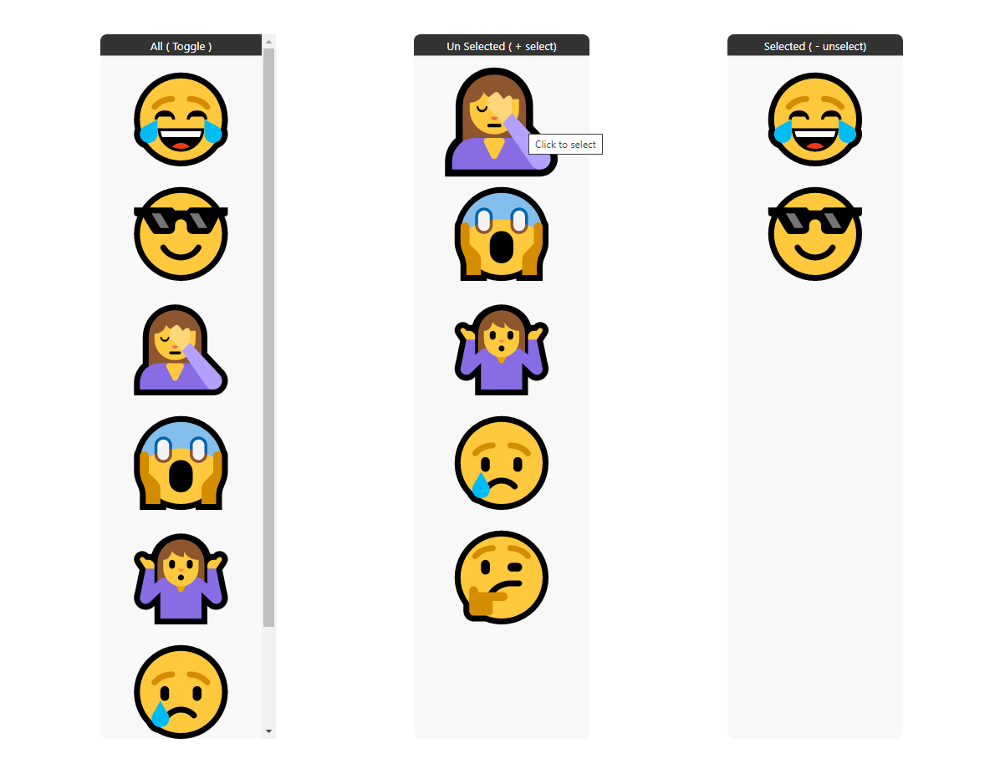

# React useSwap Swapable List Hooks

### Installation 
* From npm registry
```
npm i react-use-swap
```
* From Github ( will have more recentbut unstable updates) 
```
npm i https://github.com/Badalmishra/useSwap.git
```
### Features
* The use gives stateful list of selected and unselected items with a method to swap items between lists 
* Prop to add preselected list
#### Demo
[See Demo on Sandbox](https://codesandbox.io/s/friendly-sammet-nv0wn)
### SwapContainer.js
* usage of useSwap hook
```js
import React from "react";
import useSwap from "react-use-swap";
import ListItem from "./ListItem";

const SwapContainer = () => {
  const allItems = [
    {
      primaryKey: "1",
      icon: "😂",
    },
    {
      primaryKey: "2",
      icon: "😎",
    },
    {
      primaryKey: "3",
      icon: "🤦",
    },
    {
      primaryKey: "4",
      icon: "😱",
    },
    {
      primaryKey: "5",
      icon: "🤷",
    },
    {
      primaryKey: "6",
      icon: "😢",
    },
    {
      primaryKey: "7",
      icon: "🤔",
    },
  ];
  const { selectedItems, unSeletedItems, swap } = useSwap(allItems,allItems.slice(0,2));
  return (
    <div className={"container"}>
      <div className="list">
        <small>All ( Toggle )</small>
        <hr/>
        {allItems.map((e) => (
          <ListItem  title='Click to toggle swap' key={e.primaryKey} swap={swap} item={e} />
        ))}
      </div>
      <div className="list">
        <small>Un Selected ( + select)</small>
        <hr/>
        {unSeletedItems.map((e) => (
          <ListItem title='Click to select' key={e.primaryKey} swap={swap} item={e} />
        ))}
      </div>
      <div className="list">
        <small>Selected ( - unselect)</small>
        <hr/>
        {selectedItems.map((e) => (
          <ListItem title='click to unselect' key={e.primaryKey} swap={swap} item={e} />
        ))}
      </div>
    </div>
  );
};

export default SwapContainer;
```
### ListItem.js
* using the swap method
```JS
import React from 'react'

const ListItem = ({item,swap,title}) => {
    const handleClick = ()=>{
        swap(item.primaryKey)
    }
    return (
        <div onClick={handleClick} title={title} className={'listItem'}>
            {item.icon}
        </div>
    )
}

export default ListItem

```

### Output
